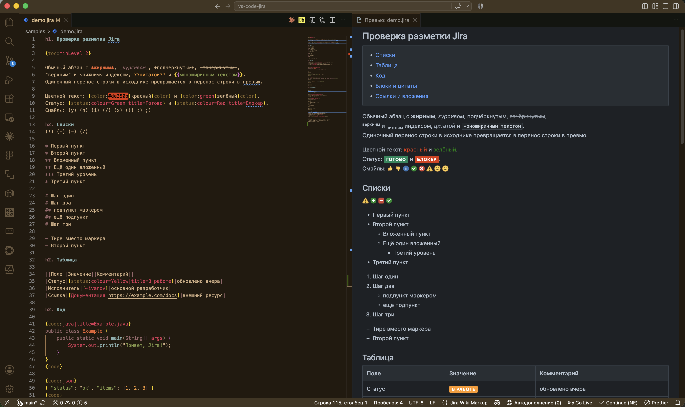

# Jira Wiki Markup — Editor & Preview

Write Jira descriptions and comments in VS Code instead of a cramped browser textarea.
Syntax highlighting for Jira Wiki Markup plus a live side-by-side preview — the same
workflow you already have for Markdown.

[Русская версия README](README.ru.md)



## Why

Jira's comment and description fields are small, and the wiki markup they accept is
easy to get wrong without seeing the result. This extension gives you a real editor
for that markup: highlighting while you type, and a preview pane that shows what Jira
will render. Write the text, then paste it into Jira.

## Features

- **Live preview** (`Ctrl+Shift+V` / `Cmd+Shift+V`) styled after the Jira UI, with light
  and dark palettes — or your current VS Code theme colors.
- **Two-way scroll sync** between editor and preview, and double-click in the preview to
  jump to the corresponding source line.
- **Syntax highlighting** in the editor *and* in the preview, including code inside
  `{code:java}`, `{code:sql}`, `{code:json}` and ~45 other languages.
- **Formatting shortcuts**: `Ctrl+B` bold, `Ctrl+I` italic, `Ctrl+Shift+M` monospace,
  `Ctrl+Alt+K` link. Pressing again removes the formatting.
- **Snippets** for the constructs you actually type: `h1`, `code`, `table`, `panel`,
  `info`, `note`, `tip`, `warning`, `link`, `status`, and more.
- **Scratch document**: the `Jira: New Jira document` command opens an empty file with
  the preview already open — write, then copy into Jira.
- **Issue links**: set `jira.baseUrl` and `ABC-123` / `[~user]` become clickable.
- **Spell checking** for Russian and English that understands the markup: code blocks,
  monospace, URLs, link targets, macro names and issue keys are skipped, so only prose
  is checked. Quick fixes offer replacements and *add to dictionary*.

The interface is English by default and switches to Russian when VS Code itself runs in
Russian. Other languages are welcome — see [Contributing](#contributing).

## Supported syntax

Everything below is recognised by the editor's highlighting and rendered in the preview.

### Headings and paragraphs

| Markup | Result |
| --- | --- |
| `h1.` … `h6.` | Headings, each with a unique anchor |
| Blank line | Starts a new paragraph |
| Single newline | Line break inside the paragraph |
| `\\` | Forced line break |
| `----` (4 or more) | Horizontal rule |
| `---` | Em dash — |
| `--` | En dash – |
| `\*` | Escapes the next character, so it is not treated as markup |

### Text effects

| Markup | Result |
| --- | --- |
| `*bold*` | **bold** |
| `_italic_` | *italic* |
| `-strikethrough-` | ~~strikethrough~~ |
| `+underline+` | underlined |
| `^superscript^` | superscript, as in `x^2^` |
| `~subscript~` | subscript, as in `H~2~O` |
| `??citation??` | citation |
| `{{monospace}}` | `monospace` |
| `{color:red}text{color}` | Coloured text; also accepts `#RRGGBB` |
| `{status:colour=Green\|title=Done}` | Coloured status badge |

### Lists

| Markup | Result |
| --- | --- |
| `* item` | Bulleted list |
| `# item` | Numbered list |
| `- item` | Dash-marked list |
| `**`, `***`, … | Nesting level — the number of markers is the depth |
| `*#`, `#*` | Mixed nesting: the last marker sets the list type |

A table or a paragraph between items ends the list, exactly as in Jira. The level still
follows the markers, so `**` after a table stays a second-level item.

### Tables

| Markup | Result |
| --- | --- |
| `\|\|header\|\|header\|\|` | Header row |
| `\|cell\|cell\|` | Body row |

A `\|` inside `[…]` or `{…}` does not split the cell, so links and macros with parameters
can be used inside cells.

### Blocks

| Markup | Result |
| --- | --- |
| `{code}` … `{code}` | Code block |
| `{code:java}` … `{code}` | Code block with syntax highlighting |
| `{code:java\|title=Foo.java}` | Code block with a title |
| `{noformat}` … `{noformat}` | Text without any formatting |
| `{quote}` … `{quote}` | Block quote |
| `bq. text` | Single-line quote |
| `{panel:title=…}` … `{panel}` | Panel; also accepts `borderStyle`, `borderColor`, `borderWidth`, `bgColor`, `titleBGColor` |
| `{info}`, `{note}`, `{tip}`, `{warning}` | Coloured message blocks, each accepting `title=` |
| `{toc}` | Table of contents; accepts `minLevel`, `maxLevel`, `type=flat` |
| `{anchor:name}` | Anchor to link to from elsewhere in the document |

`{code}` and `{noformat}` also work inside a line — most often in a table cell, as in
`| {code:java}$code = "sbp";{code} |`.

### Links and images

| Markup | Result |
| --- | --- |
| `[https://example.com]` | Link showing the address |
| `[text\|https://example.com]` | Link with a label |
| `[text\|https://example.com\|tooltip]` | Link with a tooltip |
| `[~username]` | User mention |
| `[^attachment.pdf]` | Attachment |
| `[#anchor]` | Link to an anchor in the document |
| `https://example.com` | A bare address becomes a link |
| `ABC-123` | Issue key becomes a link once `jira.baseUrl` is set |
| `!image.png!` | Image |
| `!image.png\|thumbnail!` | Thumbnail |
| `!image.png\|width=300, align=right!` | Also accepts `height`, `border`, `vspace`, `hspace`, `alt`, `title` |

Local image paths are resolved relative to the file being previewed.

### Emoticons

Rendered as the classic Atlassian icons rather than system emoji, so the preview matches
what Jira draws.

| Markup | Icon | Markup | Icon |
| --- | --- | --- | --- |
| `(+)` | green circle with a plus | `(y)` | thumbs up |
| `(-)` | red square with a minus | `(n)` | thumbs down |
| `(!)` | amber warning triangle | `(on)` | lit light bulb |
| `(/)` | green check mark | `(off)` | unlit light bulb |
| `(x)` | red cross | `(*)`, `(*y)` | yellow star |
| `(i)` | blue information mark | `(*r)` | red star |
| `(?)` | blue question mark | `(*g)` | green star |
| `(flag)` | red flag | `(*b)` | blue star |
| `(flagoff)` | grey flag | | |
| `:)` | smiling face | `:(` | sad face |
| `:D` | grinning face | `;)` | winking face |
| `:P` | face with tongue out | | |

`:-)`, `:-(`, `;-)` and the uppercase `(Y)`, `(N)`, `(I)`, `(X)` are accepted as well.

## Settings

| Setting | Default | Description |
| --- | --- | --- |
| `jira.preview.theme` | `jira` | Preview styling: `jira` colors or `editor` (current VS Code theme) |
| `jira.preview.fontSize` | `14` | Preview font size, px |
| `jira.preview.fontFamily` | system | Preview font family |
| `jira.preview.maxWidth` | `0` | Max text column width in px (`0` — unlimited) |
| `jira.preview.scrollPreviewWithEditor` | `true` | Preview follows the editor's scroll |
| `jira.preview.scrollEditorWithPreview` | `true` | Editor follows the preview's scroll |
| `jira.preview.doubleClickToSwitchToEditor` | `true` | Double-click in preview jumps to the source line |
| `jira.preview.highlightCode` | `true` | Syntax highlighting inside `{code:lang}` blocks |
| `jira.baseUrl` | `""` | Your Jira base URL, e.g. `https://company.atlassian.net` |
| `jira.spell.enabled` | `true` | Check spelling in Jira files |
| `jira.spell.languages` | `["ru","en"]` | Languages to check; the alphabet of each word decides which dictionary is used |
| `jira.spell.userWords` | `[]` | Words to always accept |
| `jira.spell.minWordLength` | `3` | Skip words shorter than this |
| `jira.spell.ignoreAllCaps` | `true` | Skip ALL-CAPS words — usually acronyms |

### About the spell checker

Dictionaries are hunspell dictionaries read through [nspell](https://github.com/wooorm/nspell).
They run in a **helper process**, not in the extension host: the Russian dictionary needs
roughly 250 MB of memory and about a second to build. The process starts on the first
check and shuts itself down after five minutes of inactivity, so the cost is only paid
while you are actually writing Jira text. Suggestions are computed lazily, when you open
the quick-fix menu.

## File types

The extension activates for `.jira`, `.jira.txt` and `.jirawiki` files. For any other
file, switch manually: `Ctrl+Shift+P` → `Change Language Mode` → `Jira Wiki Markup`.

## Installing from a `.vsix`

Grab the package from the [Releases](https://github.com/evilfaust/jira-wiki-preview/releases)
page, then either use the Extensions view (`…` menu → **Install from VSIX…**) or run:

```bash
code --install-extension jira-wiki-preview-0.4.0.vsix
```

## Development

```bash
npm install
npm run compile      # bundle into dist/
npm run watch        # rebuild on change
npm test             # parser and highlighter tests
npm run typecheck    # type checking
npm run grammar      # regenerate the TextMate grammar
npm run icon         # regenerate the extension icon
npm run vsix         # build the .vsix package
npm run release:github # tag, build and publish a GitHub release
npm run release:github -- --dry-run     # everything except the publish step
npm run release:github -- --checks-only # pre-flight checks only, no build
```

Press `F5` in VS Code to launch an Extension Development Host with `samples/demo.jira`
open — that file exercises every supported construct.

The markup parser in `src/parser/` depends on neither the VS Code API nor highlight.js
(highlighting is injected through the `highlightCode` option), so it is covered by plain
unit tests in `test/`. The TextMate grammar is generated by `scripts/gen-grammar.js`,
and the icon by `scripts/gen-icon.js`.

## Contributing

Issues and pull requests are welcome. Adding a language is mechanical: copy
`package.nls.json` to `package.nls.<locale>.json` for the manifest strings, and
`l10n/bundle.l10n.ru.json` to `l10n/bundle.l10n.<locale>.json` for runtime messages.
The tests in `test/l10n.test.ts` check that nothing is missing or orphaned.

## License

[MIT](LICENSE).

Bundled dictionaries keep their own licenses, shipped alongside them in
`dictionaries/<lang>/license`: Russian — BSD-3-Clause, English — MIT and BSD.

Jira is a trademark of Atlassian. This extension is an independent project and is not
affiliated with, endorsed by, or sponsored by Atlassian.
